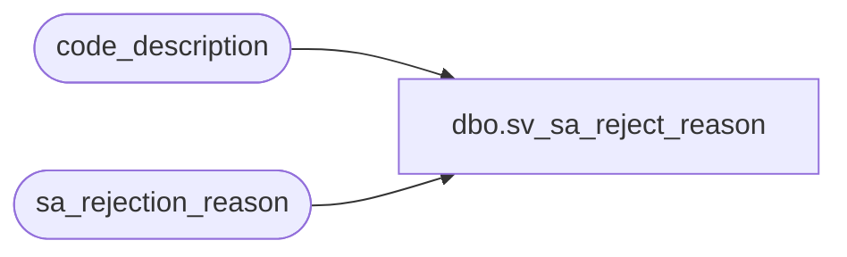

# dbo.sv_sa_reject_reason

**Database:** auditworks  
**Server:** bedrockdb01  

## Architecture Diagram



## Table Dependencies

| Referenced Table |
|---|
| code_description |
| sa_rejection_reason |

## View Code

```sql
create view dbo.sv_sa_reject_reason  AS

SELECT a.transaction_id, a.line_id, a.line_object, a.line_action, a.transaction_category, a.violated_sareject_rule, sa_rejection_reason = b.code_display_descr
FROM sa_rejection_reason a, code_description b
WHERE b.code_type = 9
AND a.violated_sareject_rule = b.code
```

