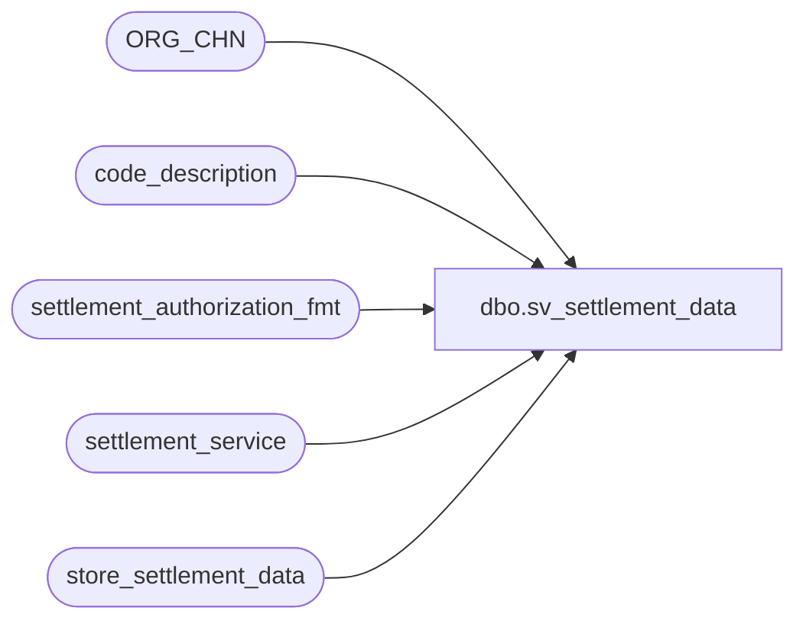

# dbo.sv_settlement_data

**Database:** auditworks  
**Server:** bedrockdb01  

## Architecture Diagram



## Table Dependencies

| Referenced Table |
|---|
| ORG_CHN |
| code_description |
| settlement_authorization_fmt |
| settlement_service |
| store_settlement_data |

## View Code

```sql
CREATE VIEW dbo.sv_settlement_data (
  store_no, store_merchant_id, interface_id,
  store_parameter1, store_parameter2, store_parameter1_descr, store_parameter2_descr,
  store_live_date, store_live_flag, auth_format, auth_format_description,
  service_name, chain_name, chain_merchant_id, service_parameters, merchandise_description
)

AS
SELECT
  a.ORG_CHN_NUM, MAX(b.store_merchant_id), d.interface_id,
  MAX(b.store_parameter1), MAX(b.store_parameter2), COALESCE(c1.code_display_descr, ' '), COALESCE(c2.code_display_descr, ' '),
  COALESCE(MIN(b.store_live_date), '01/01/2000'), COALESCE(MAX(b.store_live_flag), 1), MAX(b.auth_format), COALESCE(f.auth_format_description, ' '),
  d.service_name, d.chain_name, d.chain_merchant_id, d.service_parameters, d.merchandise_description
FROM ORG_CHN a
  INNER JOIN store_settlement_data b ON (a.ORG_CHN_NUM = b.store_no)
  INNER JOIN settlement_service d ON (b.interface_id = d.interface_id)
  LEFT JOIN settlement_authorization_fmt f ON (b.auth_format = f.auth_format)
  LEFT JOIN code_description c1 ON (d.store_param1_descr_code = c1.code AND c1.code_type = 217)
  LEFT JOIN code_description c2 ON (d.store_param2_descr_code = c2.code AND c2.code_type = 217)
GROUP BY a.ORG_CHN_NUM, d.interface_id, COALESCE(c1.code_display_descr, ' '), COALESCE(c2.code_display_descr, ' '), COALESCE(f.auth_format_description, ' '), d.service_name, d.chain_name, d.chain_merchant_id, d.service_parameters, d.merchandise_description
```

