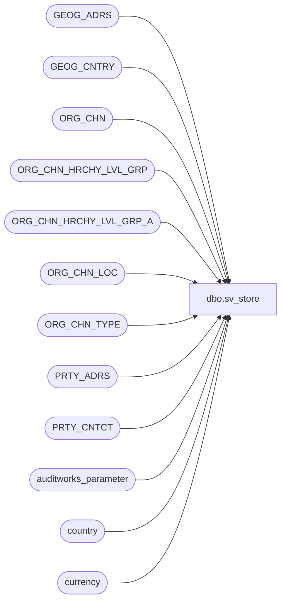

# dbo.sv_store

**Database:** auditworks  
**Server:** bedrockdb01  

## Architecture Diagram



## Table Dependencies

| Referenced Table |
|---|
| GEOG_ADRS |
| GEOG_CNTRY |
| ORG_CHN |
| ORG_CHN_HRCHY_LVL_GRP |
| ORG_CHN_HRCHY_LVL_GRP_A |
| ORG_CHN_LOC |
| ORG_CHN_TYPE |
| PRTY_ADRS |
| PRTY_CNTCT |
| auditworks_parameter |
| country |
| currency |

## View Code

```sql
create view dbo.sv_store 
AS
SELECT 
	store_no = OC.ORG_CHN_NUM, 
	store_name = OC.ORG_CHN_NAME, 
	store_short_name = OC.ORG_CHN_SHRT_NAME,  
	store_manager = NULL, 
	selling_space = SUM(OCL.AREA_SIZE), 
	open_period = NULL,  --no longer in use
	comp_period = NULL,  --no longer in use
	closed_date = OC.CLS_DATE, 
	selling_nonselling_flag = OCT.SYS_CODE,
 	MAX(div.HRCHY_LVL_GRP_CODE) division_code,
	MAX(reg.HRCHY_LVL_GRP_CODE) region_code,
	MAX(dst.HRCHY_LVL_GRP_CODE) district_code, 
 	phone_no = PH.CNTCT,--NULL, 
	tax_jurisdiction = OC.TAX_JRSDCTN_CODE,
	balancing_method = NULL, --no longer in use
	deposit_balancing_method = NULL, --no longer in use
	autoaccept_flag = OC.AUTO_ACPT,
	tax_strip_flag = NULL, --no longer in use
	outlet_store_flag = OC.ORG_CHN_TYPE_CODE,
	settlement_billing_name = OC.STLMNT_BLNG_NAME,
	store_deposit_destination = OC.PRMRY_BANK_ACNT_ID,
	gl_company = OC.GL_CMPNY_NUM,
	gl_store = OC.GL_LOC_NUM,
	currency_id = cu.currency_id,
	country_id = c.country_id,  --note must remain numeric to support existing user-defined exception/rejection rules
	comp_date = OC.COMP_DATE,
	open_date = OC.OPEN_DATE,
	city = GA.CITY,
	state_code = GA.TRTRY_CODE,
	zip_code = GA.POST_CODE,
	country_code = GA.CNTRY_CODE_ISO3,
        media_parameter_table_no = OC.MD_PRMTR_TBL_NUM,
	location_id = OC.EXTRNL_RFRNC_NUM,  
	store_status_code = NULL,   ---- no longer in use
	interstore_export_region = OC.VCHR_CNFG_TYPE,
	timezone_offset_hours = OC.GMT_OFST,
	store_export_code = OC.ORG_CHN_TYPE_CODE,
	petty_cash_line_object = NULL  -- no longer in use
FROM ORG_CHN OC
 JOIN ORG_CHN_LOC OCL
      ON OC.ORG_CHN_NUM = OCL.ORG_CHN_NUM
 JOIN ORG_CHN_TYPE OCT
      ON OC.ORG_CHN_TYPE_CODE = OCT.ORG_CHN_TYPE_CODE
 JOIN currency cu
      ON OC.DFLT_CRNCY_CODE = cu.currency_code
 LEFT OUTER JOIN PRTY_ADRS PA
      ON OC.PRTY_ID = PA.PRTY_ID
      AND OC.DFLT_ADRS_SEQ = PA.PRTY_ADRS_SEQ
      AND PA.EFCTV_STRT_DATE <= GETDATE()
      AND (PA.EFCTV_END_DATE >= GETDATE() OR PA.EFCTV_END_DATE IS NULL)
 LEFT OUTER JOIN GEOG_ADRS GA
      ON PA.ADRS_ID = GA.ADRS_ID
 LEFT OUTER JOIN GEOG_CNTRY GC
      ON GA.CNTRY_CODE_ISO3 = GC.CNTRY_CODE_ISO3
 LEFT OUTER JOIN country c
      ON GC.CNTRY_CODE_ISO2 = c.country_code
 LEFT OUTER JOIN PRTY_CNTCT PH
      ON OC.PRTY_ID = PH.PRTY_ID
      AND PH.CNTCT_TYPE_CODE = 'TLPH'
      AND SEQ_NUM = 1  --- primary
       LEFT OUTER JOIN auditworks_parameter divp
         ON divp.par_name = 'division_HRCHY_LVL_ID'
        AND divp.par_bin_value IS NOT NULL
       LEFT OUTER JOIN ORG_CHN_HRCHY_LVL_GRP_A divx
         ON divx.HRCHY_LVL_ID = divp.par_bin_value
        AND divx.ORG_CHN_NUM = OC.ORG_CHN_NUM
	 LEFT OUTER JOIN ORG_CHN_HRCHY_LVL_GRP div
         ON divx.HRCHY_LVL_GRP_ID = div.HRCHY_LVL_GRP_ID
       LEFT OUTER JOIN auditworks_parameter regp
         ON regp.par_name = 'region_HRCHY_LVL_ID'
        AND regp.par_bin_value IS NOT NULL
       LEFT OUTER JOIN ORG_CHN_HRCHY_LVL_GRP_A regx
         ON regx.HRCHY_LVL_ID = regp.par_bin_value
        AND regx.ORG_CHN_NUM = OC.ORG_CHN_NUM
	 LEFT OUTER JOIN ORG_CHN_HRCHY_LVL_GRP reg
         ON regx.HRCHY_LVL_GRP_ID = reg.HRCHY_LVL_GRP_ID
       LEFT OUTER JOIN auditworks_parameter dstp
         ON dstp.par_name = 'district_HRCHY_LVL_ID'
        AND dstp.par_bin_value IS NOT NULL
       LEFT OUTER JOIN ORG_CHN_HRCHY_LVL_GRP_A dstx
         ON dstx.HRCHY_LVL_ID = dstp.par_bin_value
        AND dstx.ORG_CHN_NUM = OC.ORG_CHN_NUM
	 LEFT OUTER JOIN ORG_CHN_HRCHY_LVL_GRP dst
         ON dstx.HRCHY_LVL_GRP_ID = dst.HRCHY_LVL_GRP_ID
GROUP BY OC.ORG_CHN_NUM, OC.ORG_CHN_NAME, OC.ORG_CHN_SHRT_NAME,
         OC.CLS_DATE, OCT.SYS_CODE, OC.TAX_JRSDCTN_CODE, 
         OC.AUTO_ACPT, OC.ORG_CHN_TYPE_CODE,
         OC.STLMNT_BLNG_NAME, PH.CNTCT,
         OC.PRMRY_BANK_ACNT_ID, OC.GL_CMPNY_NUM, OC.GL_LOC_NUM, 
         cu.currency_id, GA.CNTRY_CODE_ISO3, OC.COMP_DATE, 
         OC.OPEN_DATE, GA.CITY, GA.TRTRY_CODE, GA.POST_CODE, GA.CNTRY_CODE_ISO3,
         OC.MD_PRMTR_TBL_NUM, OC.EXTRNL_RFRNC_NUM, OC.VCHR_CNFG_TYPE, OC.GMT_OFST,
         OC.ORG_CHN_TYPE_CODE, c.country_id
```

