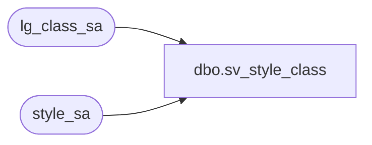

# dbo.sv_style_class

**Database:** auditworks  
**Server:** bedrockdb01  

## Architecture Diagram



## Table Dependencies

| Referenced Table |
|---|
| lg_class_sa |
| style_sa |

## View Code

```sql
create view dbo.sv_style_class
as
select s.style_reference_id, s.style_long_description, s.class_code,
       c.class_description
from  style_sa s, lg_class_sa c
where s.class_code = c.class_code
```

