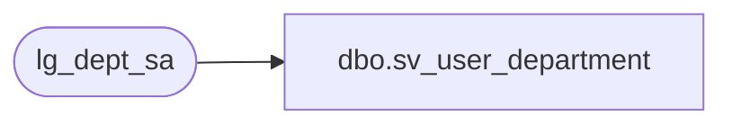

# dbo.sv_user_department

**Database:** auditworks  
**Server:** bedrockdb01  

## Architecture Diagram



## Table Dependencies

| Referenced Table |
|---|
| lg_dept_sa |

## View Code

```sql
create view dbo.sv_user_department

as
SELECT department_code, department_description FROM lg_dept_sa
```

