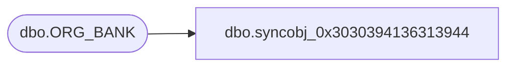

# dbo.syncobj_0x3030394136313944

**Database:** auditworks  
**Server:** bedrockdb01  

## Architecture Diagram



## Table Dependencies

| Referenced Table |
|---|
| dbo.ORG_BANK |

## View Code

```sql
create view [dbo].[syncobj_0x3030394136313944]as select  [BANK_ID],[BANK_NAME],[BANK_SHRT_NAME],[INSTN_NUM],[ACTV],[GMT_OFST],[DFLT_CRNCY_CODE],[DFLT_ADRS_SEQ]  from  [dbo].[ORG_BANK]  where HAS_PERMS_BY_NAME('[dbo].[ORG_BANK]', 'OBJECT', 'SELECT')= 1
```

