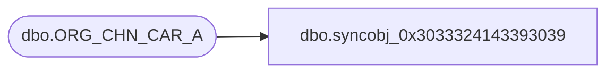

# dbo.syncobj_0x3033324143393039

**Database:** auditworks  
**Server:** bedrockdb01  

## Architecture Diagram



## Table Dependencies

| Referenced Table |
|---|
| dbo.ORG_CHN_CAR_A |

## View Code

```sql
create view [dbo].[syncobj_0x3033324143393039]as select  [CAR_ID],[CAR_SEQ_NUM],[ORG_CHN_NUM],[FDN_CSTMZTN_DATA]  from  [dbo].[ORG_CHN_CAR_A]  where HAS_PERMS_BY_NAME('[dbo].[ORG_CHN_CAR_A]', 'OBJECT', 'SELECT')= 1
```

