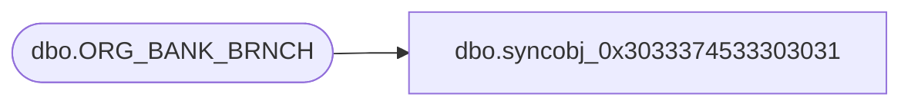

# dbo.syncobj_0x3033374533303031

**Database:** auditworks  
**Server:** bedrockdb01  

## Architecture Diagram



## Table Dependencies

| Referenced Table |
|---|
| dbo.ORG_BANK_BRNCH |

## View Code

```sql
create view [dbo].[syncobj_0x3033374533303031]as select  [BANK_BRNCH_ID],[BANK_ID],[BANK_BRNCH_NUM],[BANK_BRNCH_NAME],[BANK_BRNCH_SHRT_NAME],[GMT_OFST],[DFLT_CRNCY_CODE],[ACTV]  from  [dbo].[ORG_BANK_BRNCH]  where HAS_PERMS_BY_NAME('[dbo].[ORG_BANK_BRNCH]', 'OBJECT', 'SELECT')= 1
```

