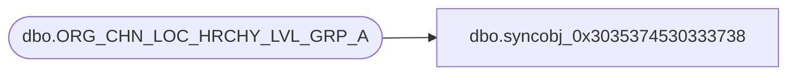

# dbo.syncobj_0x3035374530333738

**Database:** auditworks  
**Server:** bedrockdb01  

## Architecture Diagram



## Table Dependencies

| Referenced Table |
|---|
| dbo.ORG_CHN_LOC_HRCHY_LVL_GRP_A |

## View Code

```sql
create view [dbo].[syncobj_0x3035374530333738]as select  [HRCHY_LVL_GRP_ID],[LOC_ID],[HRCHY_LVL_ID],[HRCHY_ID],[VRTL]  from  [dbo].[ORG_CHN_LOC_HRCHY_LVL_GRP_A]  where HAS_PERMS_BY_NAME('[dbo].[ORG_CHN_LOC_HRCHY_LVL_GRP_A]', 'OBJECT', 'SELECT')= 1
```

