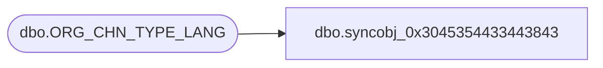

# dbo.syncobj_0x3045354433443843

**Database:** auditworks  
**Server:** bedrockdb01  

## Architecture Diagram



## Table Dependencies

| Referenced Table |
|---|
| dbo.ORG_CHN_TYPE_LANG |

## View Code

```sql
create view [dbo].[syncobj_0x3045354433443843]as select  [ORG_CHN_TYPE_CODE],[LANG_ID],[ORG_CHN_TYPE_DESC],[ORG_CHN_TYPE_SHRT_DESC]  from  [dbo].[ORG_CHN_TYPE_LANG]  where HAS_PERMS_BY_NAME('[dbo].[ORG_CHN_TYPE_LANG]', 'OBJECT', 'SELECT')= 1
```

