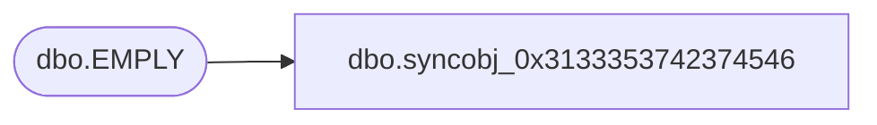

# dbo.syncobj_0x3133353742374546

**Database:** auditworks  
**Server:** bedrockdb01  

## Architecture Diagram



## Table Dependencies

| Referenced Table |
|---|
| dbo.EMPLY |

## View Code

```sql
create view [dbo].[syncobj_0x3133353742374546]as select  [EMPLY_NUM],[SLTN],[FRST_NAME],[MDL_NAME],[LAST_NAME],[SFX],[OFCL_NAME],[MAIL_NAME],[PHNTC_NAME],[SORT_NAME],[GNDR],[DATE_OF_BRTH],[ACTV],[MRTL_STS],[SHRT_NAME],[HS_ACNT_NUM],[SNRTY_DATE],[SCRTY_CLS_CODE],[DFLT_ADRS_SEQ],[PRFL_ID],[EMPLY_STS_CODE],[EDCTN_LVL_CODE],[AVLBLTY_HOUR_ID],[IMG_ATCHMNT_ID],[PRTY_ID],[PRMY_ORG_CHN_NUM],[TTL_PSTN_CODE],[FDN_CSTMZTN_DATA],[STS_EFCTV_DATE],[MAIN_LCTN_AREA]  from  [dbo].[EMPLY]  where HAS_PERMS_BY_NAME('[dbo].[EMPLY]', 'OBJECT', 'SELECT')= 1
```

