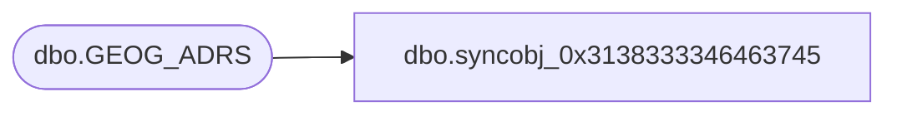

# dbo.syncobj_0x3138333346463745

**Database:** auditworks  
**Server:** bedrockdb01  

## Architecture Diagram



## Table Dependencies

| Referenced Table |
|---|
| dbo.GEOG_ADRS |

## View Code

```sql
create view [dbo].[syncobj_0x3138333346463745]as select  [ADRS_ID],[ADRS_LINE_1],[ADRS_LINE_2],[ADRS_LINE_3],[ADRS_LINE_4],[CITY],[POST_CODE],[ADRS_MTCH_KEY],[CNTRY_CODE_ISO3],[TRTRY_CODE],[ADRS_RULE_ID]  from  [dbo].[GEOG_ADRS]  where HAS_PERMS_BY_NAME('[dbo].[GEOG_ADRS]', 'OBJECT', 'SELECT')= 1
```

