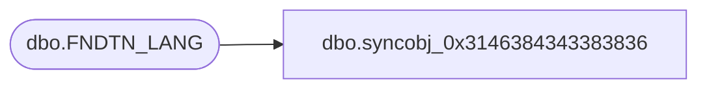

# dbo.syncobj_0x3146384343383836

**Database:** auditworks  
**Server:** bedrockdb01  

## Architecture Diagram



## Table Dependencies

| Referenced Table |
|---|
| dbo.FNDTN_LANG |

## View Code

```sql
create view [dbo].[syncobj_0x3146384343383836]as select  [LANG_ID],[LANG_ROOT],[LANG_DESC],[DFLT_LANG_ROOT],[DB_LANG_ID]  from  [dbo].[FNDTN_LANG]  where HAS_PERMS_BY_NAME('[dbo].[FNDTN_LANG]', 'OBJECT', 'SELECT')= 1
```

