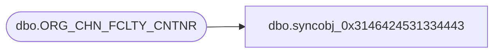

# dbo.syncobj_0x3146424531334443

**Database:** auditworks  
**Server:** bedrockdb01  

## Architecture Diagram



## Table Dependencies

| Referenced Table |
|---|
| dbo.ORG_CHN_FCLTY_CNTNR |

## View Code

```sql
create view [dbo].[syncobj_0x3146424531334443]as select  [CNTNR_ID],[CNTNR_TYPE_CODE],[CNTNR_DESC],[CNTNR_SHRT_DESC],[BIN_LOC_ID],[DPTH],[WDTH],[HGHT],[ACTV],[MSR_CODE]  from  [dbo].[ORG_CHN_FCLTY_CNTNR]  where HAS_PERMS_BY_NAME('[dbo].[ORG_CHN_FCLTY_CNTNR]', 'OBJECT', 'SELECT')= 1
```

