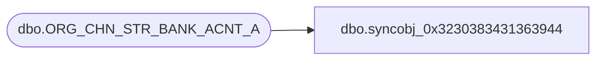

# dbo.syncobj_0x3230383431363944

**Database:** auditworks  
**Server:** bedrockdb01  

## Architecture Diagram



## Table Dependencies

| Referenced Table |
|---|
| dbo.ORG_CHN_STR_BANK_ACNT_A |

## View Code

```sql
create view [dbo].[syncobj_0x3230383431363944]as select  [ORG_CHN_NUM],[BANK_ACNT_ID]  from  [dbo].[ORG_CHN_STR_BANK_ACNT_A]  where HAS_PERMS_BY_NAME('[dbo].[ORG_CHN_STR_BANK_ACNT_A]', 'OBJECT', 'SELECT')= 1
```

