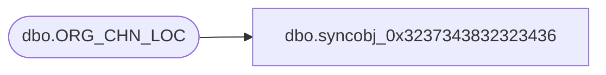

# dbo.syncobj_0x3237343832323436

**Database:** auditworks  
**Server:** bedrockdb01  

## Architecture Diagram



## Table Dependencies

| Referenced Table |
|---|
| dbo.ORG_CHN_LOC |

## View Code

```sql
create view [dbo].[syncobj_0x3237343832323436]as select  [LOC_ID],[ORG_CHN_NUM],[LOC_DESC],[PHYSCL_CYCL_CNT_IN_PRGRS],[SLNG_AREA],[NON_SLNG_AREA],[ACTV],[AREA_SIZE],[LNR_SIZE],[VLM_SIZE],[SCRTY_CLS_CODE],[LNR_MSR_CODE],[AREA_MSR_CODE],[VLM_MSR_CODE],[FDN_CSTMZTN_DATA],[ORG_CHN_AREA_CODE]  from  [dbo].[ORG_CHN_LOC]  where HAS_PERMS_BY_NAME('[dbo].[ORG_CHN_LOC]', 'OBJECT', 'SELECT')= 1
```

