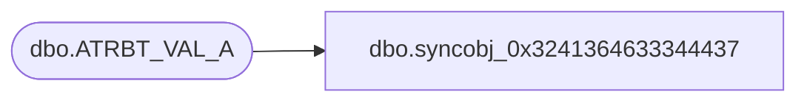

# dbo.syncobj_0x3241364633344437

**Database:** auditworks  
**Server:** bedrockdb01  

## Architecture Diagram



## Table Dependencies

| Referenced Table |
|---|
| dbo.ATRBT_VAL_A |

## View Code

```sql
create view [dbo].[syncobj_0x3241364633344437]as select  [ASGND_OBJ_NUM],[ATRBT_CODE],[ATRBT_VAL_CODE],[ATRBT_TYPE]  from  [dbo].[ATRBT_VAL_A]  where HAS_PERMS_BY_NAME('[dbo].[ATRBT_VAL_A]', 'OBJECT', 'SELECT')= 1
```

