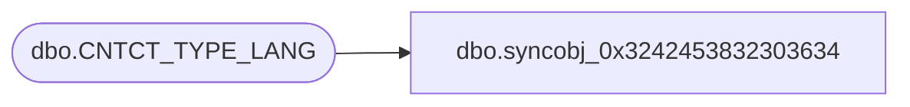

# dbo.syncobj_0x3242453832303634

**Database:** auditworks  
**Server:** bedrockdb01  

## Architecture Diagram



## Table Dependencies

| Referenced Table |
|---|
| dbo.CNTCT_TYPE_LANG |

## View Code

```sql
create view [dbo].[syncobj_0x3242453832303634]as select  [CNTCT_TYPE_CODE],[LANG_ID],[CNTCT_TYPE_DESC],[CNTCT_TYPE_SHRT_DESC]  from  [dbo].[CNTCT_TYPE_LANG]  where HAS_PERMS_BY_NAME('[dbo].[CNTCT_TYPE_LANG]', 'OBJECT', 'SELECT')= 1
```

