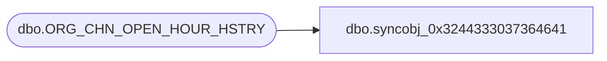

# dbo.syncobj_0x3244333037364641

**Database:** auditworks  
**Server:** bedrockdb01  

## Architecture Diagram



## Table Dependencies

| Referenced Table |
|---|
| dbo.ORG_CHN_OPEN_HOUR_HSTRY |

## View Code

```sql
create view [dbo].[syncobj_0x3244333037364641]as select  [ORG_CHN_NUM],[EFCTV_DATE],[EXPRTN_DATE],[HOUR_ID],[FDN_CSTMZTN_DATA]  from  [dbo].[ORG_CHN_OPEN_HOUR_HSTRY]  where HAS_PERMS_BY_NAME('[dbo].[ORG_CHN_OPEN_HOUR_HSTRY]', 'OBJECT', 'SELECT')= 1
```

