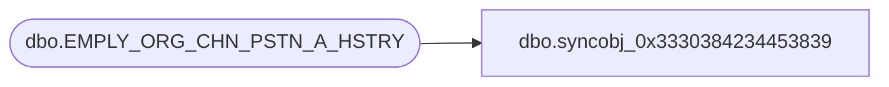

# dbo.syncobj_0x3330384234453839

**Database:** auditworks  
**Server:** bedrockdb01  

## Architecture Diagram



## Table Dependencies

| Referenced Table |
|---|
| dbo.EMPLY_ORG_CHN_PSTN_A_HSTRY |

## View Code

```sql
create view [dbo].[syncobj_0x3330384234453839]as select  [EMPLY_NUM],[EFCTV_DATE],[ORG_CHN_NUM],[PSTN_CODE],[EXPRTN_DATE],[EMPLY_SHRT_NUM],[ACNTBLTY],[PRMRY_LOC_ID],[PRMRY_LOC_A],[EMPLY_ORG_CHN_PSTN_A_HSTRY_ID],[PRMRY_DISP_FNCTN_NUM],[FDN_CSTMZTN_DATA]  from  [dbo].[EMPLY_ORG_CHN_PSTN_A_HSTRY]  where HAS_PERMS_BY_NAME('[dbo].[EMPLY_ORG_CHN_PSTN_A_HSTRY]', 'OBJECT', 'SELECT')= 1
```

