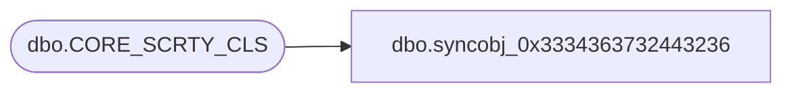

# dbo.syncobj_0x3334363732443236

**Database:** auditworks  
**Server:** bedrockdb01  

## Architecture Diagram



## Table Dependencies

| Referenced Table |
|---|
| dbo.CORE_SCRTY_CLS |

## View Code

```sql
create view [dbo].[syncobj_0x3334363732443236]as select  [SCRTY_CLS_CODE],[SCRTY_CLS_DESC],[SCRTY_CLS_SHRT_DESC]  from  [dbo].[CORE_SCRTY_CLS]  where HAS_PERMS_BY_NAME('[dbo].[CORE_SCRTY_CLS]', 'OBJECT', 'SELECT')= 1
```

