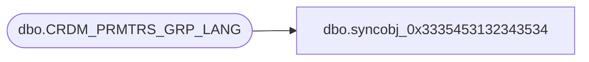

# dbo.syncobj_0x3335453132343534

**Database:** auditworks  
**Server:** bedrockdb01  

## Architecture Diagram



## Table Dependencies

| Referenced Table |
|---|
| dbo.CRDM_PRMTRS_GRP_LANG |

## View Code

```sql
create view [dbo].[syncobj_0x3335453132343534]as select  [PRMTR_GRP_CODE],[LANG_ID],[GRP_DESC]  from  [dbo].[CRDM_PRMTRS_GRP_LANG]  where HAS_PERMS_BY_NAME('[dbo].[CRDM_PRMTRS_GRP_LANG]', 'OBJECT', 'SELECT')= 1
```

