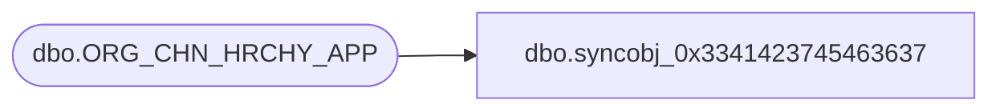

# dbo.syncobj_0x3341423745463637

**Database:** auditworks  
**Server:** bedrockdb01  

## Architecture Diagram



## Table Dependencies

| Referenced Table |
|---|
| dbo.ORG_CHN_HRCHY_APP |

## View Code

```sql
create view [dbo].[syncobj_0x3341423745463637]as select  [APP_ID],[DVSN_HRCHY_LVL_ID],[RPRT_HRCHY_ID]  from  [dbo].[ORG_CHN_HRCHY_APP]  where HAS_PERMS_BY_NAME('[dbo].[ORG_CHN_HRCHY_APP]', 'OBJECT', 'SELECT')= 1
```

