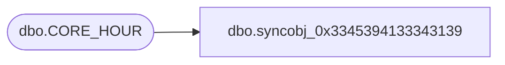

# dbo.syncobj_0x3345394133343139

**Database:** auditworks  
**Server:** bedrockdb01  

## Architecture Diagram



## Table Dependencies

| Referenced Table |
|---|
| dbo.CORE_HOUR |

## View Code

```sql
create view [dbo].[syncobj_0x3345394133343139]as select  [HOUR_ID],[HOUR_DESC],[HOUR_SHRT_DESC],[SYS_CODE],[ACTV],[HOUR_CODE]  from  [dbo].[CORE_HOUR]  where HAS_PERMS_BY_NAME('[dbo].[CORE_HOUR]', 'OBJECT', 'SELECT')= 1
```

