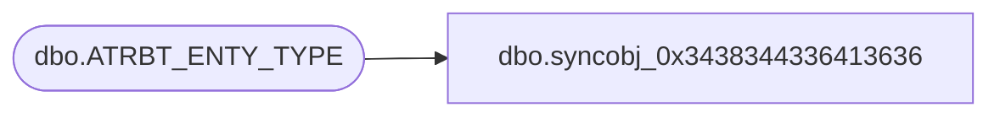

# dbo.syncobj_0x3438344336413636

**Database:** auditworks  
**Server:** bedrockdb01  

## Architecture Diagram



## Table Dependencies

| Referenced Table |
|---|
| dbo.ATRBT_ENTY_TYPE |

## View Code

```sql
create view [dbo].[syncobj_0x3438344336413636]as select  [ATRBT_TYPE],[ENTY],[ATRBT_TYPE_DESC],[ACTV]  from  [dbo].[ATRBT_ENTY_TYPE]  where HAS_PERMS_BY_NAME('[dbo].[ATRBT_ENTY_TYPE]', 'OBJECT', 'SELECT')= 1
```

