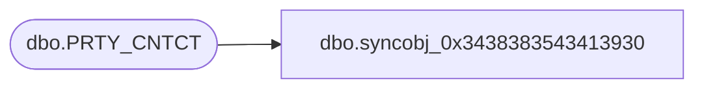

# dbo.syncobj_0x3438383543413930

**Database:** auditworks  
**Server:** bedrockdb01  

## Architecture Diagram



## Table Dependencies

| Referenced Table |
|---|
| dbo.PRTY_CNTCT |

## View Code

```sql
create view [dbo].[syncobj_0x3438383543413930]as select  [PRTY_CNTCT_ID],[PRTY_ID],[CNTCT_TYPE_CODE],[CNTCT_DTLS],[SEQ_NUM],[CNTCT],[FDN_CSTMZTN_DATA],[PRMRY]  from  [dbo].[PRTY_CNTCT]  where HAS_PERMS_BY_NAME('[dbo].[PRTY_CNTCT]', 'OBJECT', 'SELECT')= 1
```

