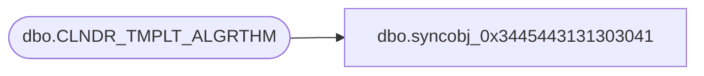

# dbo.syncobj_0x3445443131303041

**Database:** auditworks  
**Server:** bedrockdb01  

## Architecture Diagram



## Table Dependencies

| Referenced Table |
|---|
| dbo.CLNDR_TMPLT_ALGRTHM |

## View Code

```sql
create view [dbo].[syncobj_0x3445443131303041]as select  [CLNDR_TMPLT_ALGRTHM_ID],[CLNDR_TMPLT_ALGRTHM_DESC],[ALGRTHM]  from  [dbo].[CLNDR_TMPLT_ALGRTHM]  where HAS_PERMS_BY_NAME('[dbo].[CLNDR_TMPLT_ALGRTHM]', 'OBJECT', 'SELECT')= 1
```

