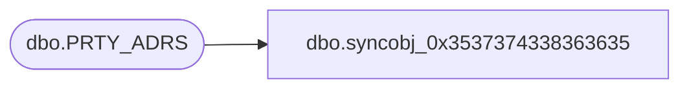

# dbo.syncobj_0x3537374338363635

**Database:** auditworks  
**Server:** bedrockdb01  

## Architecture Diagram



## Table Dependencies

| Referenced Table |
|---|
| dbo.PRTY_ADRS |

## View Code

```sql
create view [dbo].[syncobj_0x3537374338363635]as select  [PRTY_ADRS_ID],[PRTY_ID],[ADRS_ID],[PRTY_ADRS_SEQ],[EFCTV_STRT_DATE],[EFCTV_END_DATE],[ADRS_EXPRTN_RSN_ID],[PRTY_ADRS_DESC],[ADRS_FNCTN_CODE]  from  [dbo].[PRTY_ADRS]  where HAS_PERMS_BY_NAME('[dbo].[PRTY_ADRS]', 'OBJECT', 'SELECT')= 1
```

