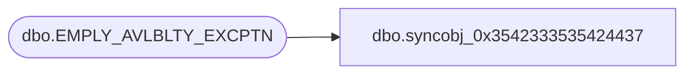

# dbo.syncobj_0x3542333535424437

**Database:** auditworks  
**Server:** bedrockdb01  

## Architecture Diagram



## Table Dependencies

| Referenced Table |
|---|
| dbo.EMPLY_AVLBLTY_EXCPTN |

## View Code

```sql
create view [dbo].[syncobj_0x3542333535424437]as select  [EMPLY_NUM],[EXCPTN_DATE],[START_TIME],[END_TIME],[RSN_ID]  from  [dbo].[EMPLY_AVLBLTY_EXCPTN]  where HAS_PERMS_BY_NAME('[dbo].[EMPLY_AVLBLTY_EXCPTN]', 'OBJECT', 'SELECT')= 1
```

