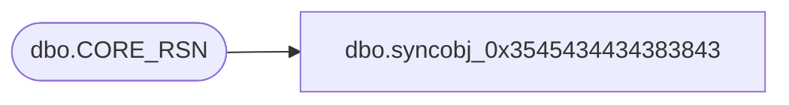

# dbo.syncobj_0x3545434434383843

**Database:** auditworks  
**Server:** bedrockdb01  

## Architecture Diagram



## Table Dependencies

| Referenced Table |
|---|
| dbo.CORE_RSN |

## View Code

```sql
create view [dbo].[syncobj_0x3545434434383843]as select  [RSN_ID],[RSN_GRP_ID],[RSN_CODE],[RSN_DESC],[RSN_SHRT_DESC],[SYS_CODE],[ACTV]  from  [dbo].[CORE_RSN]  where HAS_PERMS_BY_NAME('[dbo].[CORE_RSN]', 'OBJECT', 'SELECT')= 1
```

