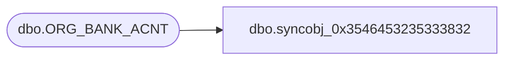

# dbo.syncobj_0x3546453235333832

**Database:** auditworks  
**Server:** bedrockdb01  

## Architecture Diagram



## Table Dependencies

| Referenced Table |
|---|
| dbo.ORG_BANK_ACNT |

## View Code

```sql
create view [dbo].[syncobj_0x3546453235333832]as select  [BANK_ACNT_ID],[BANK_BRNCH_ID],[BANK_ID],[BANK_ACNT_NUM],[BANK_ACNT_DESC],[GL_RFRNC_NUM],[CRNCY_CODE],[ACTV],[SYS_CODE]  from  [dbo].[ORG_BANK_ACNT]  where HAS_PERMS_BY_NAME('[dbo].[ORG_BANK_ACNT]', 'OBJECT', 'SELECT')= 1
```

