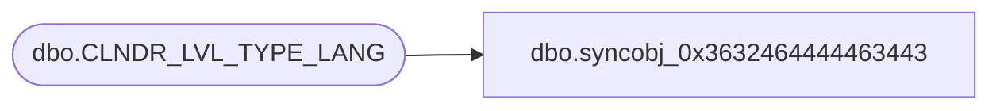

# dbo.syncobj_0x3632464444463443

**Database:** auditworks  
**Server:** bedrockdb01  

## Architecture Diagram



## Table Dependencies

| Referenced Table |
|---|
| dbo.CLNDR_LVL_TYPE_LANG |

## View Code

```sql
create view [dbo].[syncobj_0x3632464444463443]as select  [LANG_ID],[CLNDR_LVL_TYPE_ID],[CLNDR_LVL_DESC]  from  [dbo].[CLNDR_LVL_TYPE_LANG]  where HAS_PERMS_BY_NAME('[dbo].[CLNDR_LVL_TYPE_LANG]', 'OBJECT', 'SELECT')= 1
```

