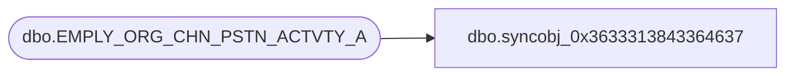

# dbo.syncobj_0x3633313843364637

**Database:** auditworks  
**Server:** bedrockdb01  

## Architecture Diagram



## Table Dependencies

| Referenced Table |
|---|
| dbo.EMPLY_ORG_CHN_PSTN_ACTVTY_A |

## View Code

```sql
create view [dbo].[syncobj_0x3633313843364637]as select  [EMPLY_NUM],[ORG_CHN_NUM],[PSTN_CODE],[ACTVTY_CODE],[GRP_ID],[FDN_CSTMZTN_DATA]  from  [dbo].[EMPLY_ORG_CHN_PSTN_ACTVTY_A]  where HAS_PERMS_BY_NAME('[dbo].[EMPLY_ORG_CHN_PSTN_ACTVTY_A]', 'OBJECT', 'SELECT')= 1
```

