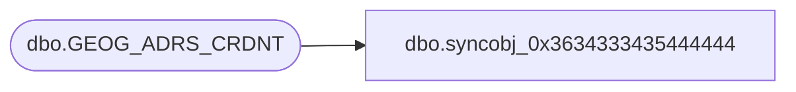

# dbo.syncobj_0x3634333435444444

**Database:** auditworks  
**Server:** bedrockdb01  

## Architecture Diagram



## Table Dependencies

| Referenced Table |
|---|
| dbo.GEOG_ADRS_CRDNT |

## View Code

```sql
create view [dbo].[syncobj_0x3634333435444444]as select  [ADRS_ID],[CRDNT_TYPE_CODE],[CRDNT_VAL]  from  [dbo].[GEOG_ADRS_CRDNT]  where HAS_PERMS_BY_NAME('[dbo].[GEOG_ADRS_CRDNT]', 'OBJECT', 'SELECT')= 1
```

