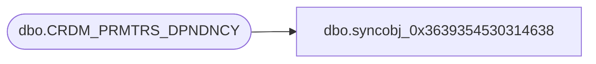

# dbo.syncobj_0x3639354530314638

**Database:** auditworks  
**Server:** bedrockdb01  

## Architecture Diagram



## Table Dependencies

| Referenced Table |
|---|
| dbo.CRDM_PRMTRS_DPNDNCY |

## View Code

```sql
create view [dbo].[syncobj_0x3639354530314638]as select  [PRMTR_NAME],[PRMTR_VAL],[DPNDNT_PRMTR_NAME],[DPNDNT_PRMTR_DRP_DWN_QRY]  from  [dbo].[CRDM_PRMTRS_DPNDNCY]  where HAS_PERMS_BY_NAME('[dbo].[CRDM_PRMTRS_DPNDNCY]', 'OBJECT', 'SELECT')= 1
```

