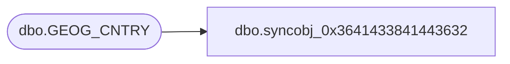

# dbo.syncobj_0x3641433841443632

**Database:** auditworks  
**Server:** bedrockdb01  

## Architecture Diagram



## Table Dependencies

| Referenced Table |
|---|
| dbo.GEOG_CNTRY |

## View Code

```sql
create view [dbo].[syncobj_0x3641433841443632]as select  [CNTRY_CODE_ISO3],[CNTRY_CODE_ISO2],[CNTRY_DESC],[CNTRY_SHRT_DESC],[TLPHNY_CNTRY_CODE],[DFLT_CRNCY_CODE],[TRNSTNL_CRNCY_CODE],[ITIN_VLDTN_FRMT],[ITIN_DSPLY_FRMT],[OPRTNG_CNTRY]  from  [dbo].[GEOG_CNTRY]  where HAS_PERMS_BY_NAME('[dbo].[GEOG_CNTRY]', 'OBJECT', 'SELECT')= 1
```

