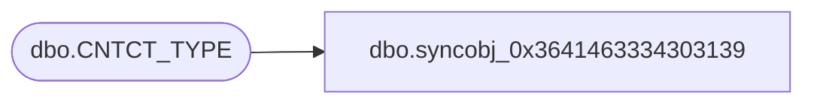

# dbo.syncobj_0x3641463334303139

**Database:** auditworks  
**Server:** bedrockdb01  

## Architecture Diagram



## Table Dependencies

| Referenced Table |
|---|
| dbo.CNTCT_TYPE |

## View Code

```sql
create view [dbo].[syncobj_0x3641463334303139]as select  [CNTCT_TYPE_CODE],[CNTCT_TYPE_DESC],[CNTCT_TYPE_SHRT_DESC],[SYS_CODE]  from  [dbo].[CNTCT_TYPE]  where HAS_PERMS_BY_NAME('[dbo].[CNTCT_TYPE]', 'OBJECT', 'SELECT')= 1
```

