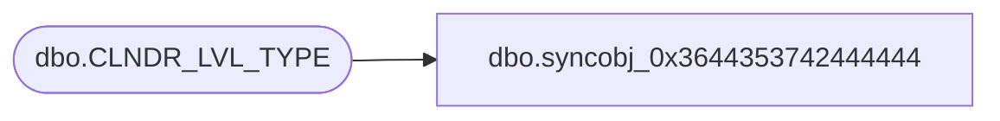

# dbo.syncobj_0x3644353742444444

**Database:** auditworks  
**Server:** bedrockdb01  

## Architecture Diagram



## Table Dependencies

| Referenced Table |
|---|
| dbo.CLNDR_LVL_TYPE |

## View Code

```sql
create view [dbo].[syncobj_0x3644353742444444]as select  [CLNDR_LVL_TYPE_ID],[CLNDR_LVL_DESC],[CLNDR_LVL_SEQ],[TIME_SPAN],[CLNDR_LVL_TYPE_IDNTY]  from  [dbo].[CLNDR_LVL_TYPE]  where HAS_PERMS_BY_NAME('[dbo].[CLNDR_LVL_TYPE]', 'OBJECT', 'SELECT')= 1
```

