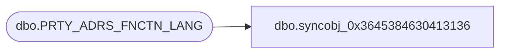

# dbo.syncobj_0x3645384630413136

**Database:** auditworks  
**Server:** bedrockdb01  

## Architecture Diagram



## Table Dependencies

| Referenced Table |
|---|
| dbo.PRTY_ADRS_FNCTN_LANG |

## View Code

```sql
create view [dbo].[syncobj_0x3645384630413136]as select  [LANG_ID],[ADRS_FNCTN_CODE],[ADRS_FNCTN_DESC],[ADRS_FNCTN_SHRT_DESC]  from  [dbo].[PRTY_ADRS_FNCTN_LANG]  where HAS_PERMS_BY_NAME('[dbo].[PRTY_ADRS_FNCTN_LANG]', 'OBJECT', 'SELECT')= 1
```

