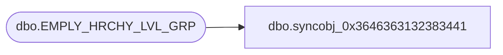

# dbo.syncobj_0x3646363132383441

**Database:** auditworks  
**Server:** bedrockdb01  

## Architecture Diagram



## Table Dependencies

| Referenced Table |
|---|
| dbo.EMPLY_HRCHY_LVL_GRP |

## View Code

```sql
create view [dbo].[syncobj_0x3646363132383441]as select  [HRCHY_LVL_GRP_ID],[HRCHY_LVL_GRP_DESC],[GRP_MBR_CHNG],[HRCHY_LVL_ID],[HRCHY_ID],[PRNT_HRCHY_LVL_GRP_ID]  from  [dbo].[EMPLY_HRCHY_LVL_GRP]  where HAS_PERMS_BY_NAME('[dbo].[EMPLY_HRCHY_LVL_GRP]', 'OBJECT', 'SELECT')= 1
```

