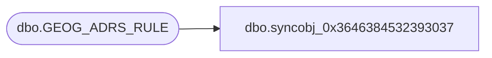

# dbo.syncobj_0x3646384532393037

**Database:** auditworks  
**Server:** bedrockdb01  

## Architecture Diagram



## Table Dependencies

| Referenced Table |
|---|
| dbo.GEOG_ADRS_RULE |

## View Code

```sql
create view [dbo].[syncobj_0x3646384532393037]as select  [ADRS_RULE_ID],[ADRS_RULE_DESC],[LINE_1_REQ],[ADRS_LINE_1_DESC],[LINE_2_REQ],[ADRS_LINE_2_DESC],[LINE_3_REQ],[ADRS_LINE_3_DESC],[LINE_4_REQ],[ADRS_LINE_4_DESC],[CITY_REQ],[ADRS_CITY_DESC],[TRTRY_REQ],[ADRS_TRTRY_DESC],[POST_CODE_REQ],[ADRS_POST_CODE_DESC],[LINE_1_VLDTN],[LINE_2_VLDTN],[LINE_3_VLDTN],[LINE_4_VLDTN],[CITY_VLDTN],[TRTRY_VLDTN],[POST_CODE_VLDTN],[POST_CODE_FRMT],[MAIL_FRMT],[ADRS_MTCH_KEY_RULE],[ADRS_DESC_DFLT_INSTRCT]  from  [dbo].[GEOG_ADRS_RULE]  where HAS_PERMS_BY_NAME('[dbo].[GEOG_ADRS_RULE]', 'OBJECT', 'SELECT')= 1
```

