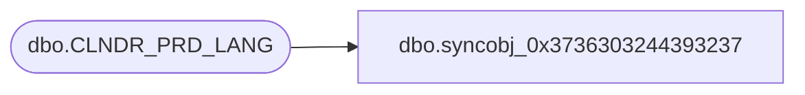

# dbo.syncobj_0x3736303244393237

**Database:** auditworks  
**Server:** bedrockdb01  

## Architecture Diagram



## Table Dependencies

| Referenced Table |
|---|
| dbo.CLNDR_PRD_LANG |

## View Code

```sql
create view [dbo].[syncobj_0x3736303244393237]as select  [LANG_ID],[CLNDR_PRD_ID],[CLNDR_PRD_NAME]  from  [dbo].[CLNDR_PRD_LANG]  where HAS_PERMS_BY_NAME('[dbo].[CLNDR_PRD_LANG]', 'OBJECT', 'SELECT')= 1
```

