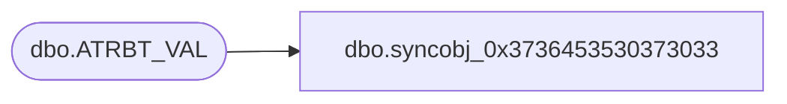

# dbo.syncobj_0x3736453530373033

**Database:** auditworks  
**Server:** bedrockdb01  

## Architecture Diagram



## Table Dependencies

| Referenced Table |
|---|
| dbo.ATRBT_VAL |

## View Code

```sql
create view [dbo].[syncobj_0x3736453530373033]as select  [ATRBT_CODE],[ATRBT_VAL_CODE],[ATRBT_VAL_DESC],[ATRBT_TYPE],[DFLT],[ACTV]  from  [dbo].[ATRBT_VAL]  where HAS_PERMS_BY_NAME('[dbo].[ATRBT_VAL]', 'OBJECT', 'SELECT')= 1
```

