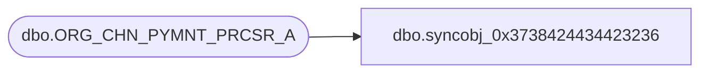

# dbo.syncobj_0x3738424434423236

**Database:** auditworks  
**Server:** bedrockdb01  

## Architecture Diagram



## Table Dependencies

| Referenced Table |
|---|
| dbo.ORG_CHN_PYMNT_PRCSR_A |

## View Code

```sql
create view [dbo].[syncobj_0x3738424434423236]as select  [PYMNT_PRCSR_CODE],[ORG_CHN_NUM],[PYMNT_PRCSR_NUM],[FDN_CSTMZTN_DATA]  from  [dbo].[ORG_CHN_PYMNT_PRCSR_A]  where HAS_PERMS_BY_NAME('[dbo].[ORG_CHN_PYMNT_PRCSR_A]', 'OBJECT', 'SELECT')= 1
```

