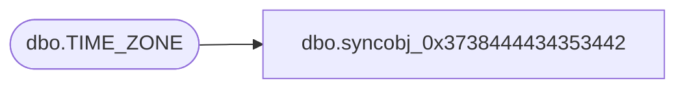

# dbo.syncobj_0x3738444434353442

**Database:** auditworks  
**Server:** bedrockdb01  

## Architecture Diagram



## Table Dependencies

| Referenced Table |
|---|
| dbo.TIME_ZONE |

## View Code

```sql
create view [dbo].[syncobj_0x3738444434353442]as select  [TIME_ZONE_ID],[RESOURCE_NAME],[GMT_OFST]  from  [dbo].[TIME_ZONE]  where HAS_PERMS_BY_NAME('[dbo].[TIME_ZONE]', 'OBJECT', 'SELECT')= 1
```

