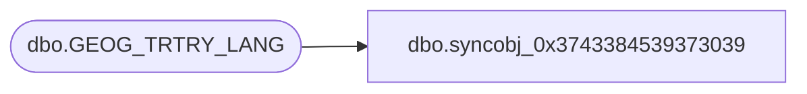

# dbo.syncobj_0x3743384539373039

**Database:** auditworks  
**Server:** bedrockdb01  

## Architecture Diagram



## Table Dependencies

| Referenced Table |
|---|
| dbo.GEOG_TRTRY_LANG |

## View Code

```sql
create view [dbo].[syncobj_0x3743384539373039]as select  [LANG_ID],[TRTRY_CODE],[CNTRY_CODE_ISO3],[TRTRY_DESC],[TRTRY_SHRT_DESC]  from  [dbo].[GEOG_TRTRY_LANG]  where HAS_PERMS_BY_NAME('[dbo].[GEOG_TRTRY_LANG]', 'OBJECT', 'SELECT')= 1
```

