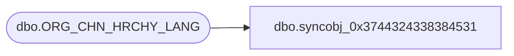

# dbo.syncobj_0x3744324338384531

**Database:** auditworks  
**Server:** bedrockdb01  

## Architecture Diagram



## Table Dependencies

| Referenced Table |
|---|
| dbo.ORG_CHN_HRCHY_LANG |

## View Code

```sql
create view [dbo].[syncobj_0x3744324338384531]as select  [HRCHY_ID],[LANG_ID],[HRCHY_DESC]  from  [dbo].[ORG_CHN_HRCHY_LANG]  where HAS_PERMS_BY_NAME('[dbo].[ORG_CHN_HRCHY_LANG]', 'OBJECT', 'SELECT')= 1
```

