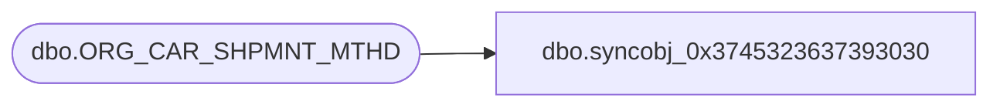

# dbo.syncobj_0x3745323637393030

**Database:** auditworks  
**Server:** bedrockdb01  

## Architecture Diagram



## Table Dependencies

| Referenced Table |
|---|
| dbo.ORG_CAR_SHPMNT_MTHD |

## View Code

```sql
create view [dbo].[syncobj_0x3745323637393030]as select  [SHPMNT_MTHD_CODE],[SHPMNT_MTHD_DESC],[SHPMNT_MTHD_SHRT_DESC],[EDI_SPRTD],[ACTV]  from  [dbo].[ORG_CAR_SHPMNT_MTHD]  where HAS_PERMS_BY_NAME('[dbo].[ORG_CAR_SHPMNT_MTHD]', 'OBJECT', 'SELECT')= 1
```

