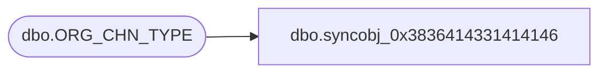

# dbo.syncobj_0x3836414331414146

**Database:** auditworks  
**Server:** bedrockdb01  

## Architecture Diagram



## Table Dependencies

| Referenced Table |
|---|
| dbo.ORG_CHN_TYPE |

## View Code

```sql
create view [dbo].[syncobj_0x3836414331414146]as select  [ORG_CHN_TYPE_CODE],[ORG_CHN_TYPE_DESC],[ORG_CHN_TYPE_SHRT_DESC],[SYS_CODE],[LOC_CTGRY_CODE],[SYSTM_DFND],[ACTV]  from  [dbo].[ORG_CHN_TYPE]  where HAS_PERMS_BY_NAME('[dbo].[ORG_CHN_TYPE]', 'OBJECT', 'SELECT')= 1
```

