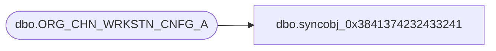

# dbo.syncobj_0x3841374232433241

**Database:** auditworks  
**Server:** bedrockdb01  

## Architecture Diagram



## Table Dependencies

| Referenced Table |
|---|
| dbo.ORG_CHN_WRKSTN_CNFG_A |

## View Code

```sql
create view [dbo].[syncobj_0x3841374232433241]as select  [WRKSTN_ID],[WRKSTN_CNFG_CODE],[EFCTV_DATE],[EXPRTN_DATE],[FDN_CSTMZTN_DATA]  from  [dbo].[ORG_CHN_WRKSTN_CNFG_A]  where HAS_PERMS_BY_NAME('[dbo].[ORG_CHN_WRKSTN_CNFG_A]', 'OBJECT', 'SELECT')= 1
```

